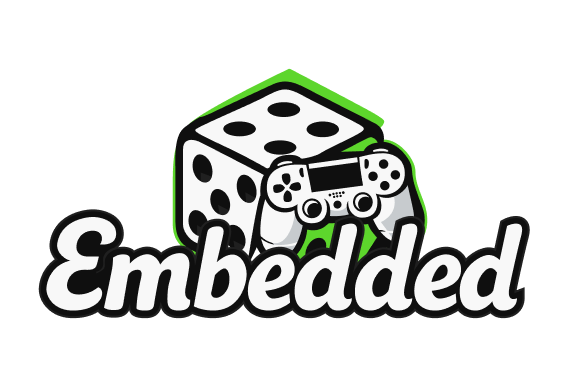
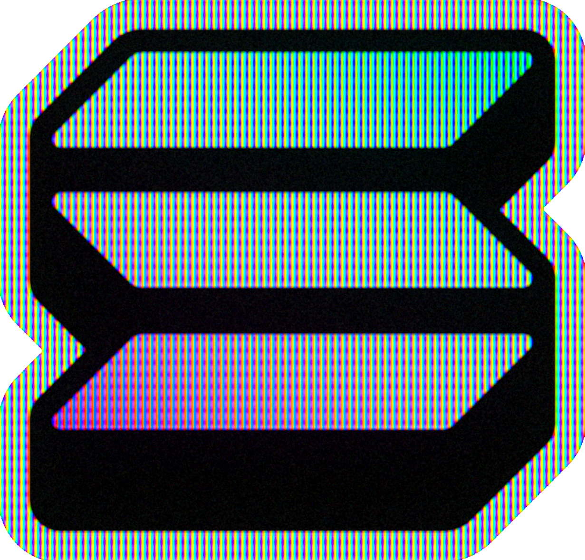

<p align="center">
  
  
</p>

<h3 align="center">Embedded Games - Cyber Arena for PSG1: PlaySolana Matrix Hackathon Submission</h3>

<p align="center">
  <a href="https://www.embedded.games/">🌐 Official Site</a> •
  <a href="#project">Project</a> •
  <a href="#cyber-arena">Cyber Arena (the game)</a> •
  <a href="#blockchain-stack-mainnet">Blockchain Stack (Mainnet)</a> •
  <a href="#repository-architecture">Repository Architecture</a> •
  <a href="#quick-start-for-judges">Quick Start for Judges</a> •
  <a href="#original-repositories">Original Repositories</a> •
  <a href="#hackathon-highlights">Hackathon Highlights</a>
</p>

---

Welcome to Embedded Games, a competitive Web3 gaming platform built for the PSG1 PlaySolana console and the web.

This repository is our official PlaySolana Matrix Hackathon submission, bundling the complete system through Git submodules.

<a id="project"></a>
## 🚀 Project

**Embedded Games** connects skill based competitive gameplay with real on-chain stakes using Solana infrastructure. This submission is live on Solana Mainnet and demonstrates full Web + Console crossplay with on-chain settlement.

<a id="cyber-arena"></a>
## 🎮 Cyber Arena

Cyber Arena is our PSG1 ready Unity title included in this bundle.

- Built in Unity
- Fully integrated with PlaySolana SDK
- Wallet native experience using Solana SDK
- In-game swaps powered by Jupiter
- On-chain game logic via Solana Anchor programs
- Match history & reporting connected to on-chain results
- Real SOL based PvP matches

The Cyber Arena Unity project lives at:

`Embedded-unity/quantum-platform-shooter-2d-3.0.4`

<a id="blockchain-stack-mainnet"></a>
## ⛓ Blockchain Stack (Mainnet)

<div style="display:flex; gap:30px;">
  <a href="https://solana.com/"></a>
  <a href="https://www.playsolana.com/"></a>
  <a href="https://jup.ag/"></a>
  <a href="https://www.anchor-lang.com/docs"></a>
</div>
<br>

Embedded Games is not a prototype, it is already operating on Solana Mainnet.

Core Web3 Components:

- Solana Mainnet deployment
- Solana SDK for wallet interactions
- PlaySolana SDK for PSG1 hardware integration
- Jupiter integration for in-game token swaps
- Anchor programs for on-chain match logic & settlement
- Real SOL betting infrastructure

Players can:

- Connect wallet
- Enter PvP matches with SOL
- Perform token swaps via Jupiter
- Have match outcomes recorded and settled on-chain
- Track match history

<a id="repository-architecture"></a>
## 🏗 Repository Architecture

This repository is a hackathon judging bundle that ties together three core repositories as submodules:

- `embedded-frontend/` → Web app (wallet connection, match entry, web games, match history, leaderboards)
- `embedded-backend/`  → API (match sessions, reporting, leaderboard, open matches) + Anchor Program
- `Embedded-unity/`    → Unity projects (includes Cyber Arena)

All three are included as Git submodules.

<a id="quick-start-for-judges"></a>
## ⚡ Quick Start for Judges

Clone everything in one step:

```bash
git clone --recurse-submodules <repo-url>
```

If you've already cloned the repository:

```bash
git submodule update --init --recursive
```

If any submodule fails due to permissions or network issues, clone them manually into their respective folders (use the links below) and then run:

```bash
git submodule update --init --recursive
```

<a id="original-repositories"></a>
## 🔗 Original Repositories

If needed, the submodules can be cloned directly from:

- Frontend: https://github.com/PsyLabsWeb3/embedded-frontend.git
- Backend:  https://github.com/PsyLabsWeb3/embedded-backend.git
- Unity:    https://github.com/PsyLabsWeb3/Embedded-unity.git

<a id="hackathon-highlights"></a>
## 🎯 Hackathon Highlights

This submission demonstrates:

- PSG1 native gameplay
- Real on-chain match settlement
- In-game swaps powered by Jupiter
- Solana Anchor smart program architecture
- Web + Console interoperability
- On-chain + backend match history tracking
- Live deployment on Solana Mainnet

Thank you for reviewing our PlaySolana Matrix Hackathon submission.

Embedded Games is already live, and this is just the beginning. See you in the Arena. 🔥

